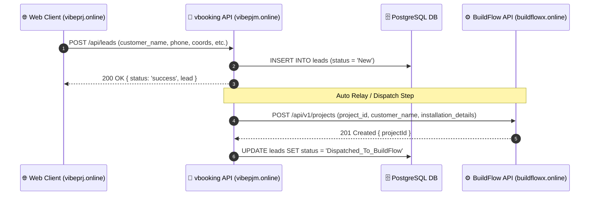

# 📄 เอกสารข้อกำหนดและการใช้งาน API: POST /api/leads (Leads API Specification)

เอกสารฉบับนี้อธิบายรายละเอียดเกี่ยวกับสเปก ประเภทข้อมูล วัตถุประสงค์ และโครงสร้างของ Body (Payload) สำหรับการใช้งาน **Leads API (`POST /api/leads`)** ในการเชื่อมโยงข้อมูลระหว่างหน้าเว็บ/แอปพลิเคชัน (`vibepjm.online` / `vibeprj.online`) กับระบบ vbooking และซิงก์ต่อเนื่องไปยัง **BuildFlow (`buildflowx.online`)**

---

## 📌 1. ภาพรวมของ API (API Overview)

| หัวข้อ | รายละเอียด |
| :--- | :--- |
| **ชื่อ API** | `Leads - Add New Lead` |
| **วัตถุประสงค์ (Objective)** | รับข้อมูลความสนใจ/ตั๋วงานใหม่ (Lead) จากหน้าเว็บหลัก (เช่น `https://vibeprj.online` หรือ Marketing Web Form) เข้ามาบันทึกในระบบ vbooking เพื่อประเมินราคา จัดสรรช่าง และส่งต่อโครงการเข้าสู่ระบบ **BuildFlow (`https://buildflowx.online`)** |
| **ประเภท (HTTP Method)** | `POST` |
| **รูปแบบข้อมูล (Content-Type)** | `application/json` |
| **การบันทึกข้อมูล (Database Storage)** | บันทึกลงตาราง `leads` บน PostgreSQL และซิงก์ลง `./data/leads.json` เป็น Fallback |

---

## 🌐 2. Endpoint URLs

* **Production URL Primary**: `https://vibepjm.online/api/leads`
* **Production URL Alias**: `https://vibeprj.online/api/leads`
* **Local Development URL**: `http://localhost:3000/api/leads`

---

## 📥 3. โครงสร้างข้อมูล Request Header & Body (Payload Specifications)

### 3.1 HTTP Headers
| Header Key | Required | Value | คำอธิบาย |
| :--- | :---: | :--- | :--- |
| `Content-Type` | ✅ | `application/json` | ระบุประเภทข้อมูลที่ส่งเป็น JSON |
| `Accept` | ❌ | `application/json` | รูปแบบข้อมูลตอบกลับที่ต้องการ |

---

### 3.2 Request Body (JSON Payload Structure)

```json
{
  "id": "lead_1722699600000",
  "customer_name": "คุณวิชัย ใจดี",
  "customer_phone": "081-234-5678",
  "customer_address": "99/1 ถ.สุขุมวิท กรุงเทพฯ",
  "customer_latitude": 13.7563,
  "customer_longitude": 100.5018,
  "map_url": "https://maps.google.com/?q=13.7563,100.5018",
  "job_type": "รีโนเวทห้องครัว",
  "notes": "สนใจประเมินราคาด่วนจากหน้าเว็บ"
}
```

### 3.3 คำอธิบายแต่ละ Field ใน Payload (Field Definitions)

| Field Name | Data Type | Required | Description | Example Value |
| :--- | :--- | :---: | :--- | :--- |
| `id` | `String` | ❌ Optional | รหัสเอกลักษณ์ของ Lead (หากไม่ระบุ ระบบจะสุ่ม `lead_<timestamp>` ให้อัตโนมัติ) | `"lead_1722699600000"` |
| `customer_name` | `String` | ✅ **Required** | ชื่อ-นามสกุล ของลูกค้าผู้แจ้งความประสงค์ | `"คุณวิชัย ใจดี"` |
| `customer_phone` | `String` | ✅ **Required** | เบอร์โทรศัพท์สำหรับติดต่อกลับ | `"081-234-5678"` |
| `customer_address` | `String` | ❌ Optional | ที่อยู่สถานที่ติดตั้ง/รีโนเวท | `"99/1 ถ.สุขุมวิท กรุงเทพฯ"` |
| `customer_latitude` | `Number` | ❌ Optional | พิกัดละติจูด (Latitude) จาก Google Maps | `13.7563` |
| `customer_longitude` | `Number` | ❌ Optional | พิกัดลองจิจูด (Longitude) จาก Google Maps | `100.5018` |
| `map_url` | `String` | ❌ Optional | ลิงก์ปักหมุดตำแหน่งพิกัดจาก Google Maps | `"https://maps.google.com/?q=13.7563,100.5018"` |
| `job_type` | `String` | ❌ Optional | ประเภทหมวดหมู่งานที่สนใจ | `"รีโนเวทห้องครัว"` |
| `notes` | `String` | ❌ Optional | หมายเหตุเพิ่มเติมจากลูกค้าหรือแอดมิน | `"สนใจประเมินราคาด่วนจากหน้าเว็บ"` |

---

## 📤 4. โครงสร้าง Response (API Output Formats)

### 4.1 กรณีทำรายการสำเร็จ (200 OK Success)

```json
{
  "status": "success",
  "message": "Lead added successfully",
  "lead": {
    "id": "lead_1722699600000",
    "customer_name": "คุณวิชัย ใจดี",
    "customer_phone": "081-234-5678",
    "customer_address": "99/1 ถ.สุขุมวิท กรุงเทพฯ",
    "customer_latitude": 13.7563,
    "customer_longitude": 100.5018,
    "map_url": "https://maps.google.com/?q=13.7563,100.5018",
    "job_type": "รีโนเวทห้องครัว",
    "notes": "สนใจประเมินราคาด่วนจากหน้าเว็บ",
    "status": "New",
    "created_at": "2026-08-03T17:27:41.000Z"
  }
}
```

### 4.2 กรณีเกิด Error (404 Not Found)

หากยิง API แล้วได้รับผลลัพธ์เป็น HTML `Cannot POST /api/leads`:
```html
<pre>Cannot POST /api/leads</pre>
```
* **วิธีแก้ไข**: ต้องทำการสั่ง **Re-deploy Container** บน Coolify ให้เป็นซอร์สโค้ดเวอร์ชันล่าสุดที่มีการสร้าง Route `/api/leads` ใน `server.js`

---

## 💻 5. ตัวอย่างการเขียนโค้ดเรียกใช้งาน (Code Examples)

### 5.1 cURL
```bash
curl -X POST "https://vibepjm.online/api/leads" \
  -H "Content-Type: application/json" \
  -d '{
    "customer_name": "คุณวิชัย ใจดี",
    "customer_phone": "081-234-5678",
    "customer_address": "99/1 ถ.สุขุมวิท กรุงเทพฯ",
    "customer_latitude": 13.7563,
    "customer_longitude": 100.5018,
    "map_url": "https://maps.google.com/?q=13.7563,100.5018",
    "job_type": "รีโนเวทห้องครัว",
    "notes": "สนใจประเมินราคาด่วนจากหน้าเว็บ"
  }'
```

### 5.2 JavaScript (Fetch API - Web Client)
```javascript
async function sendCustomerLead() {
  const leadData = {
    customer_name: "คุณวิชัย ใจดี",
    customer_phone: "081-234-5678",
    customer_address: "99/1 ถ.สุขุมวิท กรุงเทพฯ",
    customer_latitude: 13.7563,
    customer_longitude: 100.5018,
    map_url: "https://maps.google.com/?q=13.7563,100.5018",
    job_type: "รีโนเวทห้องครัว",
    notes: "สนใจประเมินราคาด่วนจากหน้าเว็บ"
  };

  try {
    const response = await fetch("https://vibepjm.online/api/leads", {
      method: "POST",
      headers: {
        "Content-Type": "application/json"
      },
      body: JSON.stringify(leadData)
    });

    const result = await response.json();
    console.log("Lead created successfully:", result);
  } catch (error) {
    console.error("Failed to send lead:", error);
  }
}
```

### 5.3 Python (Requests Library)
```python
import requests

url = "https://vibepjm.online/api/leads"
payload = {
    "customer_name": "คุณวิชัย ใจดี",
    "customer_phone": "081-234-5678",
    "customer_address": "99/1 ถ.สุขุมวิท กรุงเทพฯ",
    "customer_latitude": 13.7563,
    "customer_longitude": 100.5018,
    "map_url": "https://maps.google.com/?q=13.7563,100.5018",
    "job_type": "รีโนเวทห้องครัว",
    "notes": "สนใจประเมินราคาด่วนจากหน้าเว็บ"
}

headers = {
    "Content-Type": "application/json"
}

response = requests.post(url, json=payload, headers=headers)
print("Status Code:", response.status_code)
print("Response JSON:", response.json())
```

---

## 🔄 6. การทำงานร่วมกับ BuildFlow (`https://buildflowx.online/`)



1. เมื่อรับข้อมูล Lead จาก `POST /api/leads` เรียบร้อยแล้ว ข้อมูลจะถูกจัดเก็บลงฐานข้อมูล PostgreSQL ของ vbooking
2. ระบบจะมีฟังก์ชัน **Relay Sync** ส่งข้อมูลตั๋วงานต่อไปยัง API ปลายทางของ **BuildFlow (`POST https://buildflowx.online/api/v1/projects`)** เพื่อเปลี่ยนสถานะตั๋วจาก Lead ไปเป็น Project งานติดตั้งสำหรับช่างในระบบ BuildFlow อัตโนมัติ
