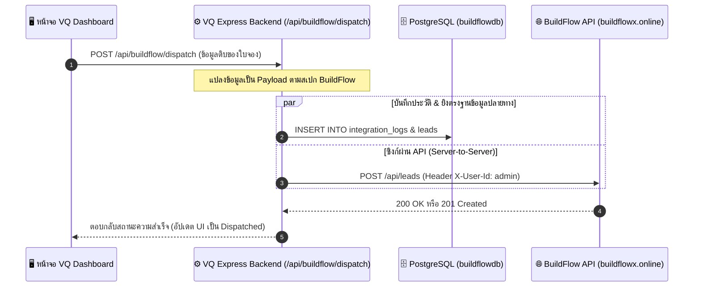

# คู่มือสถาปัตยกรรมระบบและการตั้งค่าฐานข้อมูล (System Guide & Database Infrastructure)

เอกสารฉบับนี้สรุปสถาปัตยกรรมระบบ การตั้งค่าฐานข้อมูลบน **Coolify** และการเชื่อมต่อบริการหลังบ้านของระบบ **vService & vFixQ Network**

---

## 🗄️ 1. ระบบฐานข้อมูลหลักบน Coolify (Primary Database)

ระบบ vService ใช้ **PostgreSQL** เป็นระบบจัดการฐานข้อมูลเชิงสัมพันธ์หลัก (Relational Database Management System - RDBMS) สำหรับจัดเก็บข้อมูลโครงสร้างทั้งหมดของระบบ

### 1.1 ข้อมูลการเชื่อมต่อ PostgreSQL (PostgreSQL Environment Variables)

| ตัวแปร Environment (Coolify) | ค่าเริ่มต้น / ตัวอย่าง | คำอธิบาย |
| :--- | :--- | :--- |
| `DATABASE_URL` | `postgres://postgres:postgres@<coolify-db-host>:5432/vservice_db` | Connection String หลักสำหรับเชื่อมต่อ PostgreSQL |
| `POSTGRES_HOST` | `localhost` หรือ IP ของ Container | Host/IP ของ PostgreSQL บน Coolify |
| `POSTGRES_PORT` | `5432` | พอร์ตมาตรฐานของ PostgreSQL |
| `POSTGRES_USER` | `postgres` | ผู้ใช้งานฐานข้อมูล |
| `POSTGRES_PASSWORD` | `postgres` | รหัสผ่านฐานข้อมูล |
| `POSTGRES_DB` | `vservice_db` | ชื่อฐานข้อมูลหลักของระบบ |
| `DB_SSL` | `false` | ตั้งเป็น `false` สำหรับ Internal Coolify Network |

### 1.2 โครงสร้างตารางหลักใน PostgreSQL (Database Schema)

* **ตาราง `zones`**: จัดเก็บข้อมูลโซนพื้นที่ให้บริการ รหัสโซน คำอธิบาย และรหัสไปรษณีย์ที่ครอบคลุม (`coverage_zipcodes` JSONB)
* **ตาราง `technicians`**: จัดเก็บประวัติทีมช่าง ระดับทักษะ (`skills` JSONB), โซนหลัก (`primary_zone`), โซนรอง (`secondary_zones` JSONB), อัตราเรตติ้ง, คะแนนความผิด Penalty, และข้อมูลเพิ่มเติม (`extra_data` JSONB)

### 1.3 การยิงข้อมูลตั้งต้นเข้า PostgreSQL (Database Seeding)

ระบบมีสคริปต์อัตโนมัติในการสร้างตารางและยิงข้อมูลตั้งต้น (87 โซนพื้นที่ และ 200 ทีมช่างพร้อม Skill Matrix):

```bash
# คำสั่งยิง Seed Data ขึ้น PostgreSQL
npm run db:seed
```

---

## 📦 2. ระบบจัดเก็บไฟล์ภาพและสื่อ (Object Storage on Coolify)

ระบบใช้ **MinIO Object Storage** (S3-Compatible Storage Service บน Coolify) สำหรับจัดเก็บไฟล์รูปภาพขนาดใหญ่ เช่น รูปโปรไฟล์ช่าง รูปแบนเนอร์บริการ และเอกสารแนบ

### 2.1 ข้อมูลการตั้งค่า MinIO

* **MinIO Endpoint**: URL ของ MinIO Instance บน Coolify (เช่น `https://storage.vibepjm.online`)
* **Buckets ที่ต้องสร้างใน MinIO Console**:
  1. `vservice-banners` (สำหรับรูปภาพแบนเนอร์หน้าร้าน)
  2. `vservice-services` (สำหรับรูปภาพหมวดหมู่บริการ)
  3. `vservice-avatars` (สำหรับรูปโปรไฟล์ช่างและลูกค้า)
* **Policy**: กำหนด Access Policy ของ Bucket เป็น `Public` เพื่อให้หน้าเว็บเรียกดูรูปภาพได้โดยตรง

---

## 🔄 3. กลไกสำรองข้อมูลอัตโนมัติ (Fallback & Backup Mechanism)

* **Local JSON Fallback Mode**: หากยังไม่ได้เชื่อมต่อ PostgreSQL หรืออยู่ในสภาวะ Offline ระบบ backend (`server.js`) จะสลับมาใช้การอ่าน/เขียนข้อมูลผ่านไฟล์ JSON ในโฟลเดอร์ `./data/` (`zones.json`, `technicians.json`, `line_conversations.json`) โดยอัตโนมัติ
* **Auto Sync**: ทุกครั้งที่มีการบันทึกข้อมูลผ่านหน้า UI หรือสคริปต์ `npm run db:seed` ระบบจะทำการบันทึกลง PostgreSQL พร้อมทั้งเขียนไฟล์สำรองลง `./data/` เพื่อป้องกันข้อมูลสูญหาย

---

## 🚀 4. สรุปขั้นตอนการดีพลอยบน Coolify (Deployment Quick Guide)

1. **สร้าง PostgreSQL Resource บน Coolify**:
   * ไปที่ Coolify Dashboard ➔ New Resource ➔ PostgreSQL ➔ ตั้งชื่อ DB เป็น `vservice_db`
2. **สร้าง MinIO Resource บน Coolify**:
   * New Resource ➔ MinIO Service ➔ สร้าง Buckets (`vservice-banners`, `vservice-services`, `vservice-avatars`)
3. **เชื่อมโยง Repository**:
   * New Resource ➔ Application ➔ Public/Private GitHub Repository (`https://github.com/isarachootip/vq`)
   * กำหนด Build Pack: `Dockerfile` (Port 80)
   * กำหนด Environment Variables (`DATABASE_URL`, `MINIO_ENDPOINT`, `LINE_CHANNEL_ACCESS_TOKEN` ฯลฯ)
4. **รัน Seeding Data**:
   * รันคำสั่ง `npm run db:seed` บน Server หรือ Container เพื่อนำข้อมูลขึ้น PostgreSQL

---

## ⚠️ 5. ข้อควรจำและข้อพึงระวังในการดีพลอยและซิงค์ข้อมูล (Key Lessons & Precautions)

### 5.1 การคัดลอกโฟลเดอร์ข้อมูลใน Multi-stage Docker Build (`Dockerfile`)
* **ข้อพึงระวัง:** ในโครงสร้าง `Dockerfile` แบบ Multi-stage Build (Stage 1 `builder` -> Stage 2 `runner`) ต้องระวังอย่าลืมคัดลอกโฟลเดอร์ไฟล์ข้อมูล เช่น `COPY --from=builder /app/data ./data` และ `COPY --from=builder /app/scripts ./scripts` เข้าไปยัง Stage 2
* **ผลกระทบ:** หากลืมใส่คำสั่ง COPY โฟลเดอร์ `data/` แม้บนเครื่อง Local จะมีไฟล์ข้อมูลครบถ้วน แต่ตัว Container บน Coolify จะหาไฟล์ข้อมูลสำรองไม่พบ ส่งผลให้ API เช่น `/api/technicians` หรือ `/api/zones` ตอบกลับเป็นอาร์เรย์ว่าง `[]`

### 5.2 การจัดการแคชในเบราว์เซอร์ของผู้ใช้งาน (`localStorage` Cache Guard)
* **ข้อพึงระวัง:** แอปพลิเคชัน Frontend มีระบบบันทึกสถานะชั่วคราวลงใน `localStorage` ของผู้ใช้ (`vfixq_technicians`, `vfixq_zones`) เพื่อความรวดเร็วในการเปิดหน้าเว็บ
* **แนวทางป้องกัน:** เมื่อมีการอัปเดตขนาดชุดข้อมูลตั้งต้น (เช่น เพิ่มช่างเป็น 200 ทีม หรือเพิ่มโซนเป็น 87 โซน) โค้ดใน `App.tsx` ต้องมีการตั้งค่า **Dataset Threshold Validation** เช่น:
  * ตรวจสอบว่า `loaded.length < 200` สำหรับช่าง หรือ `loaded.length < 87` สำหรับโซน
  * หากพบว่าข้อมูลในแคชผู้ใช้เป็นเวอร์ชันเก่า ต้องสั่งรีเซ็ตและ Auto-Sync ชุดข้อมูลใหม่ทดแทนทันที เพื่อป้องกันปัญหาผู้ใช้งานเห็นข้อมูลไม่ครบถ้วน

### 5.3 วงจรการอัปเดตโค้ดขึ้น Production (Coolify Deployment Lifecycle)
* **ข้อพึงระวัง:** การอัปเดตไฟล์ข้อมูล หรือสคริปต์บนเครื่อง Local จะยัง **ไม่มีผลบน Production ทันที** จนกว่าจะมีการ Push Commit ขึ้น GitHub Repository (`origin/main`)
* **ขั้นตอนที่ถูกต้อง:**
  1. ตรวจสอบสถานะการแก้ไขบน Local: `git status`
  2. Commit และ Push ขึ้น GitHub:
     ```bash
     git add .
     git commit -m "feat/fix: description of changes"
     git push origin main
     ```
  3. ตรวจสอบสถานะ Build บน Coolify Dashboard
  4. ทำการ **Hard Refresh (`Ctrl + F5` หรือ `Cmd + Shift + R`)** บนหน้าเว็บเบราว์เซอร์เพื่อดึงไฟล์ Build ล่าสุดเสมอ

---

## 🔗 6. การเชื่อมโยงข้อมูลกับระบบ BuildFlow (BuildFlow System Integration)

ระบบ VQ ทำงานร่วมกับระบบ **BuildFlow** (`buildflowx.online`) เพื่อใช้ในการจัดส่งใบสั่งงานและข้อมูลลูกค้าไปยังห้องแชทสื่อสารของช่างสนาม โดยมีการทำงานที่เป็นเอกภาพและปลอดภัยผ่าน API

### 6.1 เงื่อนไขและกฎธุรกิจในการจ่ายงาน (Business Rules)
* **การป้องกันข้อมูลไม่สมบูรณ์ (Data Quality Guard):** คิวงานที่จะนำส่งระบบ BuildFlow ต้องมีสถานะเป็น **`Scheduled`** และ**ต้องจัดสรรทีมช่างหน้างานเป็นที่เรียบร้อยแล้วเท่านั้น (มีข้อมูล `assignedTech` ที่ตรงกัน)**
* **มาตรการควบคุมบน UI:** หากระบบตรวจพบว่าสถานะไม่ตรง หรือทีมช่างในใบสั่งงานเป็นค่าว่าง/ไม่มีตัวตนอยู่จริง ปุ่ม **"ส่ง BuildFlow" (สีม่วง)** จะถูกซ่อนโดยอัตโนมัติบนหน้าจอ Dashboard เพื่อควบคุมความถูกต้องของข้อมูล (ป้องกันไม่ให้มีการจ่ายตั๋วงานไร้คนรับผิดชอบเข้าระบบปลายทาง)

### 6.2 สถาปัตยกรรมและทางเดินข้อมูล (Data Architecture Flow)


### 6.3 ตารางการแปลงพัสดุข้อมูล (Data Mapping Specs)

ระบบหลังบ้านของ VQ จะทำหน้าที่เป็น Relay Proxy แปลงข้อมูลและยิงต่อไปยัง API ปลายทางของ BuildFlow (`POST /api/leads`) โดยจับคู่ฟิลด์ดังนี้:

| ฟิลด์ต้นทาง (VQ Schema) | ฟิลด์ปลายทาง (BuildFlow Schema) | ประเภทข้อมูล | คำอธิบาย / กฎการประมวลผล |
| :--- | :--- | :---: | :--- |
| `customerName` | `customer_name` | `String` | ชื่อลูกค้าผู้รับบริการติดตั้ง |
| `customerPhone` | `customer_phone` | `String` | เบอร์ติดต่อลูกค้า |
| `customerAddress` \| `addressZone` | `customer_address` | `Text` | ที่อยู่ในการเข้าไปดำเนินงาน |
| `latitude` | `customer_latitude` | `Numeric` | พิกัดละติจูด (แปลงเป็น Number) |
| `longitude` | `customer_longitude` | `Numeric` | พิกัดลองจิจูด (แปลงเป็น Number) |
| - | `map_url` | `Text` | สร้างอัตโนมัติ: `https://www.google.com/maps?q={lat},{lng}` (ถ้ามีพิกัด) |
| `installationTypeName` \| `job_type` | `job_type` | `String` | ประเภทของงานบริการติดตั้ง |
| - | `status` | `String` | กำหนดค่าเริ่มต้นเป็น `"New"` เสมอ |
| - | `notes` | `Text` | รวมรหัสตั๋ว เขตพื้นที่ และชื่อช่าง: `[Ticket: {ticketNo}] [Zone: {zone}] [Tech: {techName}]` |

### 6.4 ระบบสำรองข้อมูลเมื่อระบบขัดข้อง (Fail-Safe Logs)
* เมื่อส่งสำเร็จ ข้อมูลประวัติการส่งจะถูกบันทึกลงฐานข้อมูล PostgreSQL ตาราง `integration_logs` และบันทึกลงตาราง `leads` ของฐานข้อมูล `buildflowdb` เพื่อเป็น Single Source of Truth
* หากเกิดกรณีเครือข่ายขัดข้อง หรือฐานข้อมูลไม่พร้อมทำงาน ระบบหลังบ้านจะเซฟประวัติเป็น JSON ล็อคเก็บในไฟล์ `./data/integration_logs.json` เป็น Fallback สำรองทันที ช่วยการันตีว่าข้อมูลการจ่ายงานติดตั้งจะไม่สูญหายแน่นอน


